# The problem with RAIDZ or why you probably won't get the storage efficiency you think you will get.
As a ZFS rookie, I struggled quite a bit to figure out what settings I should use for my Proxmox hypervisor. Hopefully, this will help other ZFS rookies. 
This text focuses on Proxmox, but it generally applies to all ZFS systems.

This entire document assumes an ashift of 12 (4K), which is the default for modern drives!

## TLDR
RAIDZ is only great for sequential reads and writes of large files (>1MB). An example would be a file server that mostly hosts big files.  
For VMs or iSCSI, RAIDZ will not give you the storage efficiency you think you will get, and it will also perform poorly. 
Use mirror instead. It's a pretty long text, but you can jump to the conclusion and the efficiency tables at the end.  

## Introduction and glossary
Before we start, some ZFS glossary. These are important to understand the examples later on.

### sector size:
older HDDs used to have a sector size of 512b, while newer HDDs have 4k sectors. SSDs can have even bigger sectors, but their firmware controllers are mostly tuned for 4k sectors. There are still enterprise HDDs that come with 512e, where the "e" stands for emulation. These are not 512b but 4k drives, they only emulate to be 512. For this whole text, I assume that we have normal drives with 4k sectors.

### ashift:
ashift sets the sector size, ZFS should use. ashift is a power of 2, so setting ashift=12 will result in 4k. Ashift must match your drive's sector size. Extremely likely this will be 12 and also automatically detected.

### dataset:
A dataset is inside a pool and is like a file system. There can be multiple datasets in the same pool, and each dataset has its own settings like compression, dedup, quota, and many more. They also can have child datasets that by default inherit the parent's settings. Datasets are useful to create a network share or create a mount point for local files. In Proxmox, datasets are mostly used locally for ISO images, container templates, and VZdump backup files.

### zvol:
zvols or ZFS volumes are also inside a pool. Rather than mounting as a file system, it exposes a block device under /dev/zvol/poolname/data/vm-100-disk-0 and so on. 
This is where your Proxmox RAW virtual machine disks are located. You could also make it available to other network hosts using iSCSI. 

### recordsize:
Recordsize applies to datasets. ZFS datasets use by default a recordsize of 128KB. It it goes up to 16MB (since openZFS v2.2). ZFS dynamically adjusts the actual block size used for storage based on the size of the data being written. So record size is not a static number but a max number. All blocks bigger than the record size will be split up into chunks the size of record size.  

### volblocksize:
Zvols have a volblocksize property. Unlike recordsize, this is a static value that defines what voblocksize should be presented to the VM disk. 
Since openZFS v2.2 the default value is 16k. It used to be 8k on older Proxmox installations. 

**This is  important to understand**. Since volblocksize is a static value, and that 16k is the default for Proxmox VMs, all data will be written in 16k blocks. So if you have a 1TB Windows Server VM that only has huge files like movies in it, that behaves exactly the same as many, many small 16k text files that have a combined size of 1TB. This is a huge downside of zvols over datasets, since you are forcing your data into small blocks that might suffer from the "RAIDZ problem". This is why you should use mirrors for Zvols. 

### padding:
Since ZFS does not use fixed sized stripes (explained later on), we could potentially run into a situation where we have empty sectors inbetween data, that is to small to ever be used. That is why ZFS reserves some padding to make such situation impossible.
ZFS requieres multiples of p+1 sectors to prevent unusable-small gaps on the disk. p is the number of parity, so for RAIDZ1 this would be 1+1=2, for RAIDZ2 this would be 2+1=3, for RAIDZ3 this would be 3+1=4. 
For example, if you use a RAIDZ2, you want a multiple of (p + 1) or (2 + 1). In the first class I learned that this equals 3 😄 
The total number of sectors of every stripe has to be devidable by 3. Otherwise we add padding. For example a 6 sector wide stripe is fine, because 6 / 3 = 2.
A 8 stripe wide write on the other hand does not work, because 8 / 3 = not an even number. 
We add one padding sector. Now we have 8 + 1 sectors. That equals 9. 9 / 3 works perfectly fine. 
Padding is not really writing data onto disks, it just leaves these sectors out or reserves them. 
Trust me, it gets simpler with some real life examples later on. 

### LBA: 
This stands for Logical block addressing. This basically the numbering of the hard drive sectors. Since we said that we use only 4k drives in this text, a HDD or SSD LBA will always be a 4k sectors.

### Compression:
Compression happens before we write a stripe. If we want to write a 200k file, and it can be compressed down to 160k, we only need to write 160k. LZ4 compression is basically free and without performance impacts. You should not disable it, since it especially helps with compression zeros. For simplicity, when I talk about a 20k write, I mean a write that was 20k after it got compressed. So a 30k file that gets compressed to 20k, in this text I will always label as a "20k write"

With that technical glossary out of the way, let's look at real examples 🙂

## Dataset
Datasets apply to ISOs, container templates, and VZDump and are not that affected by the RAIDZ problem. 
Simply because datasets usually use bigger blocks and it is mostly the small blocks suffering from this storage efficiency issue. 

I think it is easier to understand the RAIDZ problem, by looking at datasets first and Zvol later on. Because the problem is the same, Zvols are only more prone to that problem.  

Let's look at an example of a 3-disk wide RAIDZ1. The max stripe width obviously can't be bigger than the number of disk. 
So the max stripe width is 3.  

Now we want to write 16k data.  
That would look like these yellow stripes:  
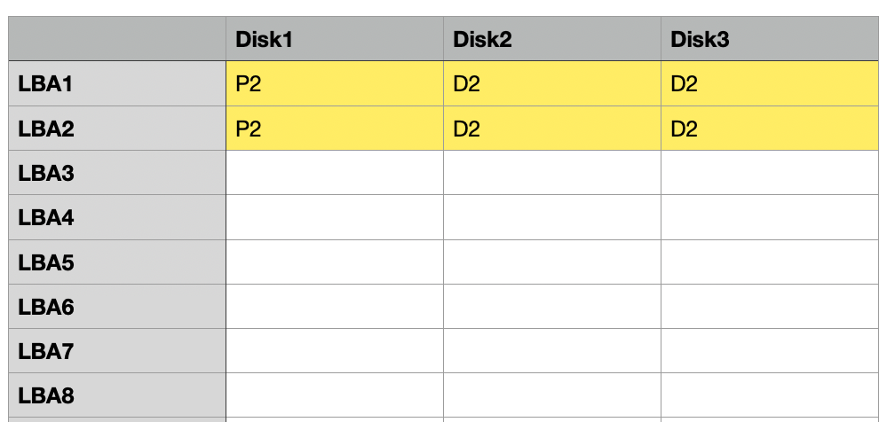

If you count all the D2 sectors, you relize that we have 4 data sectors. 4 data sectors with 4k are 16k total, just like we wanted. 
We also have 2 sectors parity. 

As you can see, we simply needed multiple stripes (in this case two) to reach your data goal. 

So how about a 128k write?
To store a 128k file, we need 128k / 4k = 32 data sectors in total.
We know that a single stripe has 2 data sectors, so we need 16 stripes in total.  
Or you could also say that to store a 128k file, we need 128k / 8k data sectors = 16 stripes.  
Each of these stripes consists of two 4k data sectors and a 4k parity sector.  
This would look like this blue write:
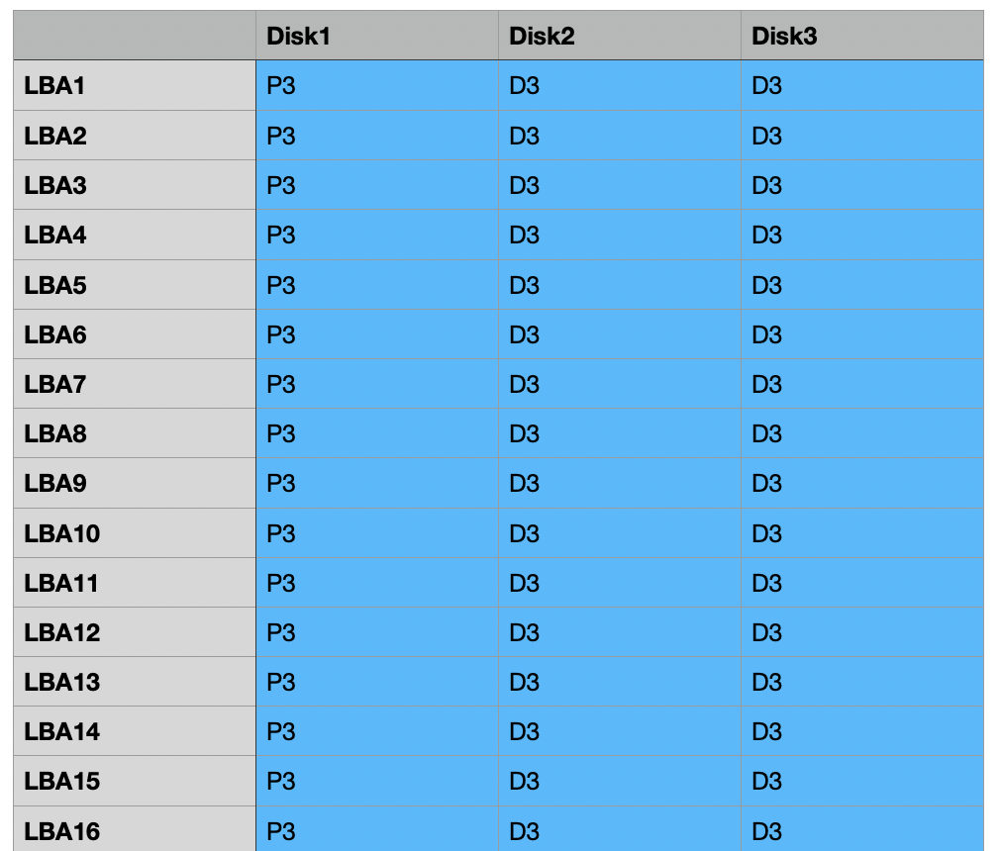

In total, we store 128k data sectors (16 stripes * 8k data sectors) and 64k parity sectors (16 stripes * 4k parity sectors).  
Data sectors + parity sectors = total sectors  
128k + 64k = 192k.  
That means we write 192k to store 128k data.  
192k is 48 sectors (192 / 4k).  
48 we can divide by 2, so there is no padding needed.  
128k / 192k = 66.66% storage efficiency.  

This is a best-case scenario. Just like one would expect from a 3-wide RAID5 or RAIDZ1, you "lose" a third of storage.  
This works picturesque perfect, because your 3 wide RAIDZ1 pool and 128k writes are a pool geometry match made in heaven. 

But what about a 20k file?

We do the same steps for our 20k file.  
To store 20k, we need 20k / 4k = 5 data sectors.  
To store 5 data sectors, when each stripe has 2 data sectors, we need 2.5 stripes in total.  
Half-data stripes don't exist, instead we use two 2 data sectors stripes and a 1 data sector stripe. 
That is why we need 3 stripes. This would look like this green stripe:
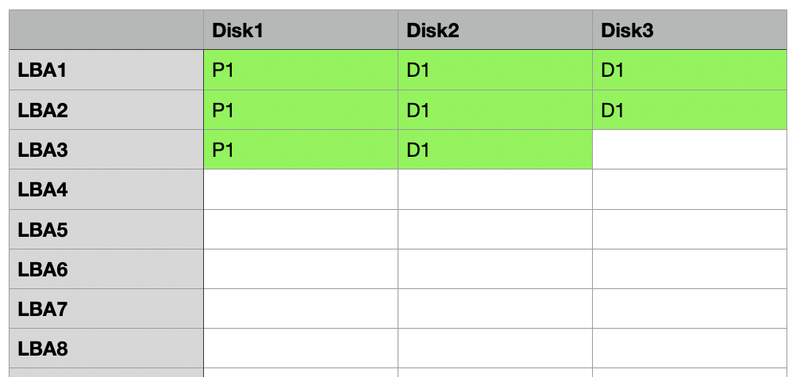

The first stripe has 8k data sectors and a 4k parity sector.  
Same for the second stripe, 8k data sectors and a 4k parity sector.  
The third stripe is special.  
We already saved 16k of data in the first two sectors, so we only need to save another 4k.  
That is why the third stripe has a 4k data sector and a 4k parity sector.  
In total, we store 20k data sectors (2 times 8k from the first two stripes and 4k from the third stripe) and 12k parity sectors (3 stripes with 4k).  
20k + 12k = 32k.  
That means we write 32k to store 20k data.  
32k is 8 sectors (32 / 4).  
8 sectors is a multiple of 2, so there is no padding needed.  

But now the efficiency has changed. If we calculate all together, we wrote 20k data sectors, 12k parity sectors.  
We wrote 32k to store a 20k file.  
20k / 32k = 62.5% storage efficiency.  
This is not what you intuitively would expect. We thought we would get 66.66%! 

Damn you ZFS! But it get's even worse!

We do the same steps for a 28k file.  
To store 28k, we need 28k / 4k = 7 data sectors.  
To store 7 data sectors, each stripe has 2 data sectors, so we need 3.5 stripes in total.  

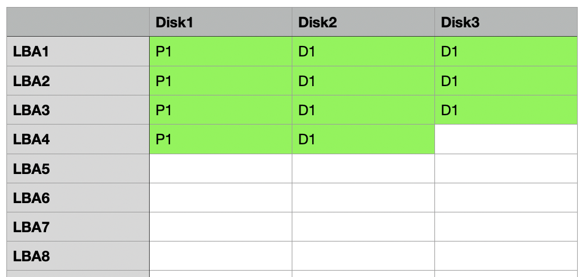

The first three stripes have 8k data sectors and a 4k parity sector.  
The fourth stripe is special.  
We already saved 24k of data in the first two sectors, so we only need to save another 4k.  
That is why the fourth stripe has a 4k data sector and a 4k parity sector.  
In total, we store 28k data sectors and 16k parity sectors (4 stripes with 4k).  
28k + 16k = 44k.  
That means we write 44k to store 28k data.  
44k is 11 sectors (44 / 4).  
11 sectors is not a multiple of 2, so there is padding needed.  
Damn, what does that mean?  
We add an extra 4k padding sector to get 12 sectors in total.  
12 / 2 works. 
So it will look like this:
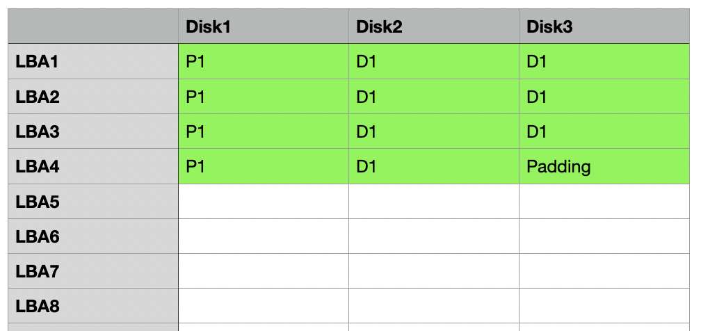
Why that is, we take a look in the next chapter. For now, we just accept it.  

The efficiency has changed again. If we calculate all together, we wrote 28k data sectors, 16k parity sectors, and one 4k padding sector.  
We wrote 48k to store a 28k file.  
28k / 48k = 58.33% storage efficiency.  
This is not what you intuitively would expect. We thought we would get 66.66%!  

What happens if we want to save a 4k file?  

We calculate the same thing for a 4k file.  
We simply store a 4k data sector on one disk and one parity sector on another disk. In total, we wrote a 4k data sector and a 4k parity sector.  
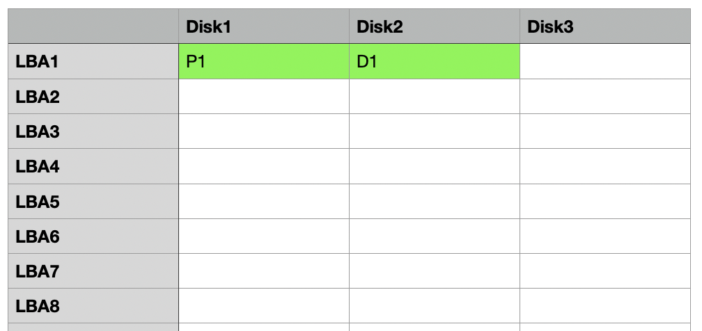
We wrote 8k in sectors to store a 4k file.  
4k / 8k = 50% storage efficiency.  

This is the same storage efficiency we would expect from a mirror!  Holy shit, that is bad!

**Conclusion for datasets:**  
If you have a 3-wide RAIDZ1 and only write huge files like pictures, movies, and songs, the efficiency loss gets negligible. For smaller files it isn't great and for 4k files, RAIDZ1 only offers the same storage efficiency as mirror.  

## Why do we need padding?
That is a good question. Let's look at an example of what would happen if ZFS would not make use of padding. 
We have this data:
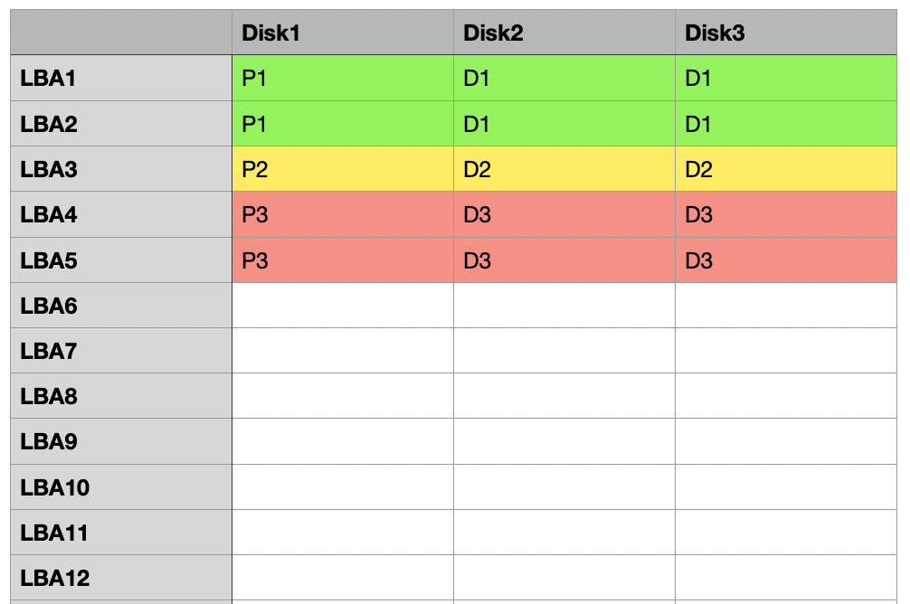

Green, yellow and red stripes. The yellow stripe is a ZFS illegal stripe, because it is 3 sectors and 3 / 2 does not work and would need padding. 
But ok, we made this. 
Now we delete the yellow file. 
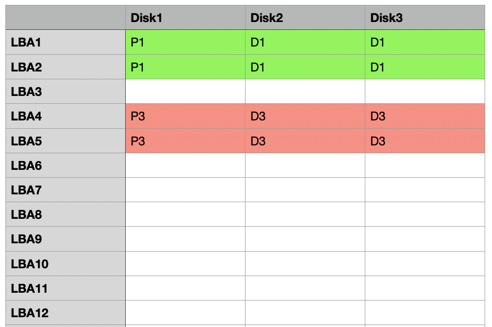

We get some free space.
We write a none illegal blue stripe.
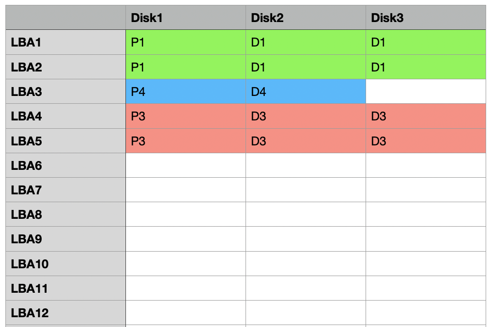

Now we have one white sector that is not used. What should we do with it?
The blue stripe is in this RAIDZ1 the smallest possible write. There is no smaller than two sector writes. So that storage is basically lost, until we delete the red stripe. Nahh, that is bad. So we use padding instead. 

We do the same thing again, but this time with padding. This is how we start:
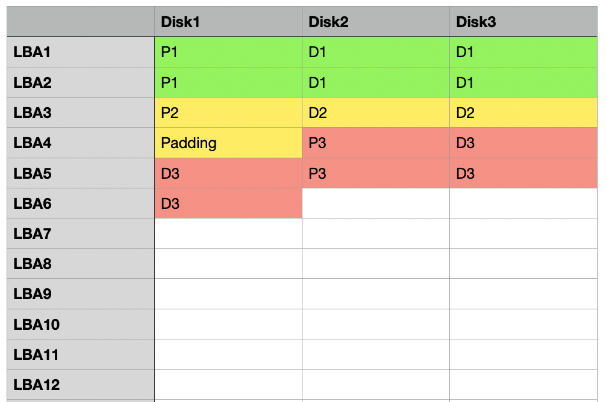

We delete the yellow one. 
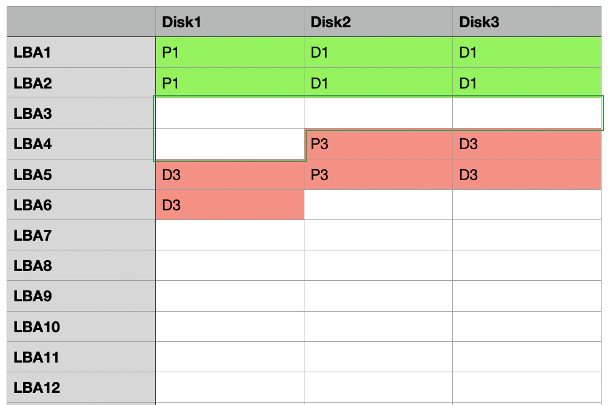

and write the blue one
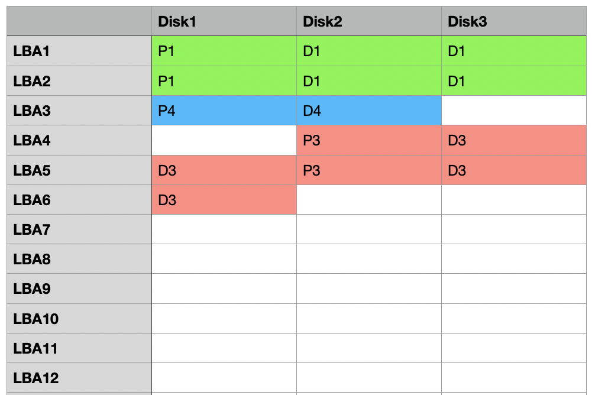

That way we get two blocks empty, which we could fill with another 4k data write like this in yellow:
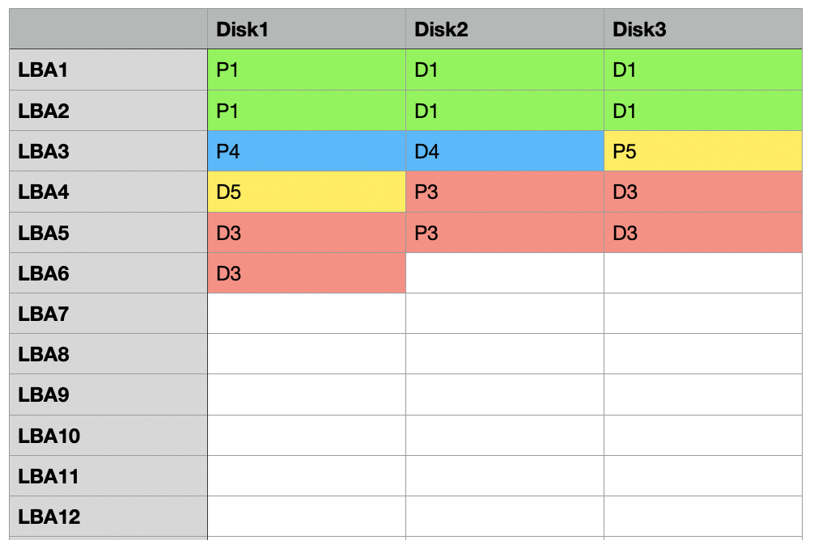

That is why we need padding.  

## ZVOL and volblocksize
For Proxmox we mostly don't use datasets. We use VMs with RAW disks that are stored on a Zvol.  
For Zvols and their fixed volblocksize, it gets more complicated.  

In the early days, the default volblocksize was 8k and it was recommended to turn off compression.  
Nowadays, LZ4 compression is enabled by default and the default volblocksize is 16k.   
16k is a good default value that works well for every VM.   

**The main difference between recordsize and datasets is, that this is a fixed and rather small value**. 
If you zvol for VM uses 16k as volblocksize, every single write will be a 16k block! Every one. Even if you write 1MB, it will write multiple 16k chunk blocks. 
This is very different from datasets, which use record size, which is not a static but a max value!  
Since "the problem with RAIDZ" especially applies to smaller writes, like you saw in the datatset example above, this problem all of a sudden gets huge with VMs! Because now we force every write to be only 16k in size.   

In theory, you want to have writes that exactly match your volblocksize.  
For MySQL or MariaDB, this would be 16k. But because you can't predict compression, and compression works very well for stuff like MySQL, you can't predict the size of the writes.  
A larger volblocksize is good for mostly sequential workloads and can gain compression efficiency.  
Smaller volblocksize is good for random workloads, has less IO amplification, and less fragmentation, but will use more metadata and have worse space efficiency.  
We look at the different volblocksizes and how they behave on different pools.  
Don't change it unless you have some fixed 64k SQL DB or something similar going on, on a second disk.
Some people in the forums recommend using 64k on SSDs, because SSDs won't become slower because of fragmentation. I would probably still advise against it, due to read and write ampflification, and some implications on movability to other systems. I would rather stick with the defaults. 

### volblocksize 16k
This is the default size for openZFS since 2.2.  

#### RAIDZ1 with 3 drives
With 3 drives, we get a stripe that is 3 drives wide.  
Each stripe has two 4k data sectors (8k) and one 4k parity sector.  
For a volblock of 16k, we need two stripes, because one stripe stores 8k data and two stripes will store the needed 16k (16k/8k).  
Each stripe has two 4k data sectors, two stripes are in total 16k. 
Each stripe has one 4k parity sector, two stripes are in total 8k.  
That gets us to 24k in total to store 16k.  
24k is 6 sectors and that can be divided by 2 so there is no padding needed.  
Storage efficiency is 66.66%, as expected.  

#### RAIDZ1 with 4 drives
With 4 drives, we get a stripe 4 drives wide.  
Each stripe has three 4k data sectors (12k) and one 4k parity sector.  
For a volblock of 16k, we need 1.33 stripes (16k/12k).  
The first stripe has three 4k data sectors, in total 12k.  
The first stripe also has one 4k sector for parity. 
The second stripe has one 4k data sector.  
The second stripe also has one 4k sector for parity.  
In total, we have four 4k data sectors and two 4k parity sectors.  
That gets us to 24k in total to store 16k.  
24k is 6 sectors and that can be divided by 2 so there is no padding needed.  
We expected a storage efficiency of 75%, but only got 66.66%!

#### RAIDZ1 with 5 drives
With 5 drives, we get a stripe 5 drives wide.  
Each stripe has four 4k data sectors (16k) and one 4k parity sector.  
For a volblock of 16k, we need 1 stripe (16k/16k).  
In total, we have four 4k data sectors and one 4k parity sector.  
That gets us to 20k in total to store 16k.  
20k is 5 sectors and that can't be divided by 2 so there is an additional padding sector needed.  
That gets us to 24k in total to store 16k.  
We expected a storage efficiency of 80%, but only got 66.66%!

#### RAIDZ1 with 10 drives
With 10 drives, we get a stripe 10 drives wide.  
That 10 drives wide stripe in theory would get us 9 data sectors and one parity sector.  
A single stripe could thus hold 9 * 4k = 36k.  
But that is of no use to us, we only need 16k!  
ZFS will shorten the stripes.  
For a volblock of 16k, we need one stripe with 4 data sectors and one parity sector.  
In total, we have four 4k data sectors and one 4k parity sector.  
The stripe is only 5 drives wide.  
That gets us to 20k in total to store 16k.  
20k is 5 sectors and that can't be divided by 2 so there is an additional padding sector needed.  
That gets us to 24k in total to store 16k.  
We expected a storage efficiency of 90%, but only got 66.66%!  

**Notice something? No matter how wide we make the RAIDZ1, there are no efficiency gains beyond 5 drives. This is because we can't make the stripe any wider, no matter how wide we make your RAIDZ1. Because of padding, even going from 4 to 5 drives wide does not help with storage efficiency.**  

#### RAIDZ2 with 4 drives
With 4 drives, we get a stripe 4 drives wide.  
Each stripe has two 4k data sectors and two 4k parity sectors.  
For a volblock of 16k, we need two stripes (16k/8k = 2).  
That gets us to 32k in total to store 16k.  
32k is 8 sectors and that can't be divided by 3 so there is padding needed.  
We need another padding sector to get to 9 sectors total.  
9 sectors can be divided by 3.  
That gets us to 36k in total to store 16k.  
We expected a storage efficiency of 50%, but only got 44.44%!  
That is WORSE than mirror!  

#### RAIDZ2 with 5 drives  
With 5 drives, we get a stripe 5 drives wide.  
Each stripe has three 4k data sectors and two 4k parity sectors.  
For a volblock of 16k, we need 1.33 stripes (16k/12k).  
The first stripe has three 4k data sectors, in total 12k.  
The first stripe also has two 4k sectors for parity.  
The second stripe has one 4k data sector.  
The second stripe also has two 4k sectors for parity.  
In total, we have four 4k data sectors and four 4k parity sectors.  
That gets us to 32k in total to store 16k.  
32k is 8 sectors and that can't be divided by 3 so there is padding needed.  
We need another padding sector to get to 9 sectors total.  
9 sectors can be divided by 3.  
That gets us to 36k in total to store 16k.   
We expected a storage efficiency of 60%, but only got 44.44%!  
That is WORSE than mirror!

#### RAIDZ2 with 6 drives  
With 6 drives, we get a stripe 6 drives wide.  
Each stripe has four 4k data sectors and two 4k parity sectors.  
For a volblock of 16k, we need one stripe (16k/16k = 1).  
That gets us to 24k in total to store 16k.  
24k is 6 sectors and that can be divided by 3 so there is no padding needed.  
We expected a storage efficiency of 66.66%, and got 66.66%!  

#### RAIDZ2 with 10 drives
With 10 drives, we get a stripe 6 drives wide.   
This is because we don't need 10 drives to store 16k.  
It also behaves exactly as with 6 drives.   
Each stripe has four 4k data blocks and two 4k parity blocks.  
For a volblock of 16k, we need one stripe (16k/16k = 1).  
That gets us to 24k in total to store 16k.  
We expected a storage efficiency of 80%, but only got 66%!  

### volblocksize 64k
Some users in the forums recommend 64k on SSDs.  
I am no VM expert by any means, but there are still a lot of workloads that are smaller than 64k.  
I would recommend using volblocksize 64k with caution. You will could get huge read-write amplification and fragmentation.  

#### RAIDZ1 with 3 drives
With 3 drives, we get a stripe 3 drives wide.  
Each stripe has two 4k data sectors (8k) and one 4k parity sector.  
For a volblock of 64k, we need eight stripes (64k/8k = 8).  
Each stripe has two 4k data sectors, eight stripes are in total 64k. 
Each stripe has one 4k parity sector, eight stripes are in total 32k. 
That gets us to 96k in total to store 64k.  
96k is 24 sectors and that can be divided by 2 so there is no padding needed.  
Storage efficiency is 66.66%, as expected.   

#### RAIDZ1 with 4 drives
With 4 drives, we get a stripe 4 drives wide.  
But not all stripes have three 4k data sectors (12k) and one 4k parity sector.  
For a volblock of 64k, we need 5.33 stripes (64k/12k).  
Five stripes have three 4k data sectors, in total 60k.  
Five stripes also have one 4k sector for parity, in total 20k. 
The sixth stripe has one 4k data sector.  
The sixth stripe also has one 4k sector for parity.  
In total, we have sixteen 4k data sectors and six 4k parity sectors.  
That gets us to 88k in total to store 64k.  
88k is 22 sectors and that can be divided by 2 so there is no padding needed.  
We expected a storage efficiency of 75%, but only got 72.72%!

#### RAIDZ1 with 5 drives
With 5 drives, we get a stripe 5 drives wide.  
For a volblock of 64k, we need 4 stripes (64k/16k).  
Each stripe has four 4k data sectors and one 4k parity sector.  
In total, we have 16 4k data sectors and 4 4k parity sectors.  
That gets us to 80k in total to store 64k.  
80k is 20 sectors and that can be divided by 2 so there is no padding needed.  
Storage efficiency is 80%, as expected.  

#### RAIDZ1 with 6 drives
With 6 drives, we get a stripe 6 drives wide.  
But not all stripes have five 4k data sectors (20k) and one 4k parity sector.  
For a volblock of 64k, we need 3.2 stripes (64k/20k).  
Three stripes have five 4k data sectors, in total 60k.  
Three stripes also have one 4k sector for parity, in total 12k. 
The fourth stripe has one 4k data sector.  
The fourth stripe also has one 4k sector for parity.  
In total, we have 16 4k data sectors and four 4k parity sectors.  
That gets us to 80k in total to store 64k.  
80k is 20 sectors and that can be divided by 2 so there is no padding needed.  
We expected a storage efficiency of 83.33%, but only got 80%!
The same problem applies for 7 or 8 drives wide! 

#### RAIDZ1 with 9 drives
With 9 drives, we get a stripe 9 drives wide.  
For a volblock of 64k, we need two stripes (64k/32k). 
Each stripe has eight 4k data sectors and one 4k parity sector.  
In total, we have 16 4k data sectors and two 4k parity sectors.  
That gets us to 72k in total to store 64k.  
72k is 18 sectors and that can be divided by 2 so there is no padding needed.  
Storage efficiency is 88.88%, as expected.

#### RAIDZ1 with 10 drives
With 10 drives, we get a stripe 10 drives wide.  
But not all stripes have nine 4k data sectors (36k) and one 4k parity sector.  
For a volblock of 64k, we need 1.77 stripes (64k/36k). 
First stripe has nine 4k data sectors, in total 36k.  
First stripe also has one 4k sector for parity. 
The second stripe has seven 4k data sectors, in total 28k .  
The second stripe also has one 4k sector for parity.  
In total, we have 16 4k data sectors and two 4k parity sectors.  
That gets us to 72k in total to store 64k.  
72k is 18 sectors and that can be divided by 2 so there is no padding needed.  
We expected a storage efficiency of 90%, but only got 88.88%!
The same problem applies for all RAIDZ1 that are wider than 10 drives!  

#### RAIDZ2 with 6 drives
With 6 drives, we get a stripe 6 drives wide.  
Each stripe has four 4k data sectors and two 4k parity sectors.  
For a volblock of 64k, we need four stripes (64k/16k = 4).  
That gets us to 96k in total to store 64k.  
96k is 24 sectors and that can be divided by 3 so there is no padding needed.  
Storage efficiency is 66.66%, as expected.  

#### RAIDZ2 with 7 drives
With 7 drives, we get a stripe 7 drives wide.  
But not all stripes have five 4k data sectors (20k) and two 4k parity sectors.  
For a volblock of 64k, we need 3.2 stripes (64k/20k).  
Three stripes have five 4k data sectors, in total 60k.  
Three stripes also have two 4k sectors for parity, in total 24k. 
The fourth stripe has one 4k data sector.  
The fourth stripe also has two 4k sectors for parity.  
In total, we have 16 4k data sectors and eight 4k parity sectors.  
That gets us to 96k in total to store 64k.  
96k is 24 sectors and that can be divided by 3 so there is no padding needed.  
We expected a storage efficiency of 71.42%, but only got 66.66%!
Same is true for 8 or 9 wide RAIDZ2!  

#### RAIDZ2 with 10 drives
With 10 drives, we get a stripe 10 drives wide.  
Each stripe has eight 4k data sectors and two 4k parity sectors.  
For a volblock of 64k, we need two stripes (64k/32k = 2).  
That gets us to 80k in total to store 64k.  
80k is 20 sectors and that can't be divided by 3 so there is padding needed.  
We add a padding sector to get 21 sectors in total. 
That gets us to 84k in total to store 64k.  
We expected a storage efficiency of 80%, but only got 76.19%!
The same problem applies to all RAIDZ between 10 and 17 drives wide!  

## efficiency tables
Efficiency tables for different numbers of drives, with 16k or 64k volblocksize, and what efficiency you would naturally expect to get. When expectations match up, it is formatted in bold.  

## RAIDZ1

|          | 3 drives   | 4 drives | 5 drives | 6 drives | 7 drives | 8 drives | 9 drives   | 10 drives | 11 drives | 12 drives |
|----------|------------|----------|----------|----------|----------|----------|------------|-----------|-----------|-----------|
| 16k      | **66.66%** | 66.66%   | 66.66%   | 66.66%   | 66.66%   | 66.66%   | 66.66%     | 66.66%    | 66.66%    | 66.66%    |
| 64k      | **66.66%** | 72.72%   | **80%**  | 80%      | 80%      | 80%      | **88.88%** | 88.88%    | 88.88%    | 88.88%    |
| expected | **66.66%** | 75%      | **80%**  | 83.33%   | 85.71%   | 87.5%    | **88.88%** | 90%       | 90.90%    | 91.66%    |

## RAIDZ2
|          | 4 drives | 5 drives | 6 drives   | 7 drives | 8 drives | 9 drives | 10 drives | 11 drives | 12 drives | 13 drives | 14 drives | 15 drives | 16 drives | 18 drives  |
|----------|----------|----------|------------|----------|----------|----------|-----------|-----------|-----------|-----------|-----------|-----------|-----------|------------|
| 16k      | 44.44%   | 44.44%   | **66.66%** | 66%      | 66%      | 66%      | 66%       | 66%       | 66%       | 66%       | 66%       | 66%       | 66%       | 66%        |
| 64k      | 48.48%   | 53.33%   | **66.66%** | 66.66%   | 66.66%   | 66.66%   | 76.19%    | 76.19%    | 76.19%    | 76.19%    | 76.19%    | 76.19%    | 76.19%    | **88.88%** |
| expected | 50%      | 60%      | **66.66%** | 71.42%   | 75%      | 77.77%   | 80%       | 81.81%    | 83.33%    | 84.61%    | 85.71%    | 87.5%     | 88.23%    | **88.88%** |

## Conclusion
RAIDZ is different from traditional RAID and often has worse storage efficiency than expected.  
You can get better space efficiency and compression gains with a larger volblocksize, 
but it will come at the cost of read and write amplification and create higher fragmentation. 
Remember that all these variants will only write as fast as the slowest disk in the pool.
Mirrors have a worse storage efficiency but will offer twice the write performance with 4 drives and 4 times the write performance with 8 drives over a RAIDZ pool.  
**Use NVMe (or at least SSD) mirrors for Zvols**  
**Use RAIDZ2 for huge, sequentially written and read files in datasets**
